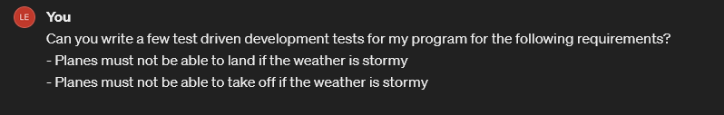
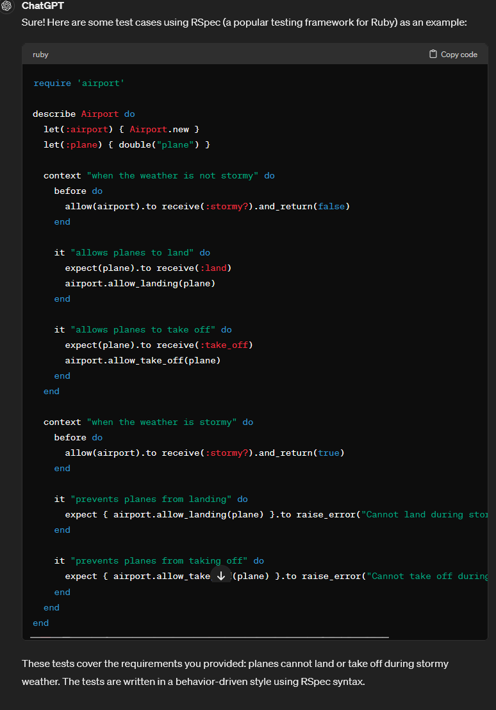

# Additional Requirements
## Stormy Weather

ChatGPT Log: https://chat.openai.com/share/04c29422-3e54-4f28-a810-260543ef304a

I asked Chat GPT for some test ideas for stormy weather conditions in my program to see if I've covered all grounds of testing.

ChatGPT responded with a list of tests in a behavior-driven style using RSpec syntax which seemed similar to the tests I've written for my user stories.

Using the above, I checked to see if my original test cases were adequate and if I missed any test cases from my user stories and wrote the test and code for the TDD of the additional requirements.