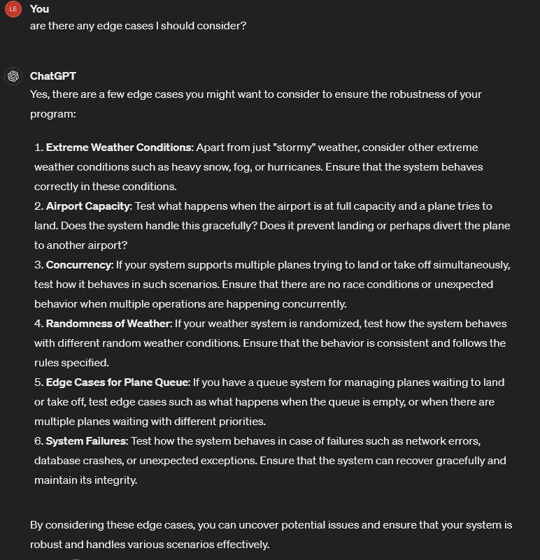
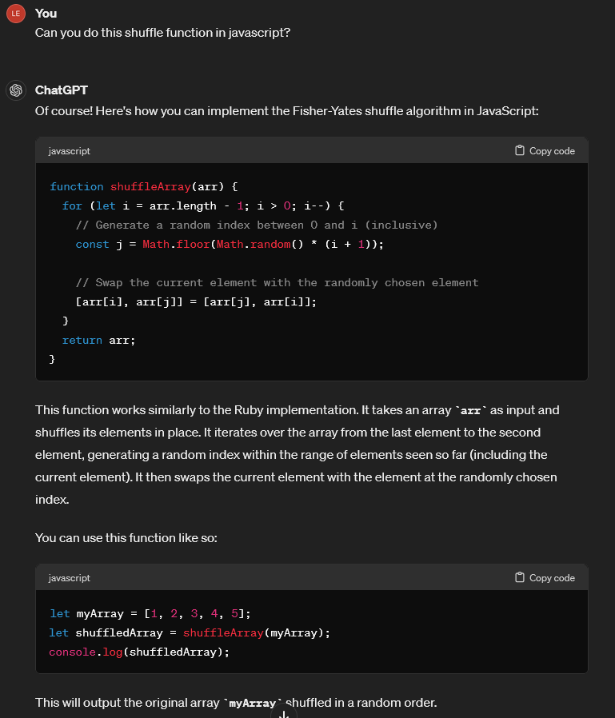

# Additional Requirements
## Stormy Weather

ChatGPT Log: https://chat.openai.com/share/04c29422-3e54-4f28-a810-260543ef304a

I asked Chat GPT for some test ideas for stormy weather conditions in my program to see if I've covered all grounds of testing. 

ChatGPT responded with a list of tests in a behavior-driven style using RSpec syntax which seemed similar to the tests I've written for my user stories.  

Using the above, I checked to see if my original test cases were adequate and if I missed any test cases from my user stories and wrote the test and code for the TDD of the additional requirements.

I then enquired about some edge cases I may not that thought off during the creation and test phases of my process for the stormy weather conditions which has helped me understand some of the potential risks this software may have.  

During the code of my weather randomised function. At first I wanted to generate a random number and depending on whether it was odd or even I would set the odd number to equal the weather to be stormy. However this would mean the program has a 50% chance of being stormy and didn't feel realistic with other possible weather choices or look at expansion for this scope specification in the future.
  
I therefore asked ChatGPT about how to write a shuffle function that shuffles an array (which I'd hold my various weather values in):

It showed me how to do this via Ruby which was not what I was looking for and thus I asked it to write it in javascript so it was compatible with my code:

I then implemented this shuffle function into my Weather class code to help randomise the weather forecast from the possible list of weather. This would help with scope expansion in the future and also gives a little more realistic outlook of when planes can land/takeoff.