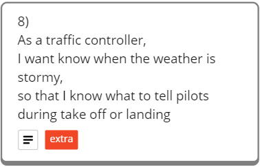
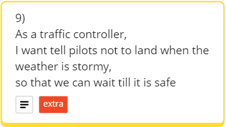
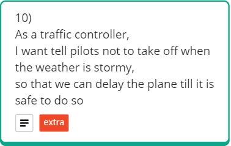

# Airport Challenge

## Domain Models and Test Plan
Available on Miro board at https://miro.com/app/board/uXjVKSYJDag=/?share_link_id=767210795169

### User Story 1
**User Story**
 
  **Domain Model**
| Objects | Properties                | Messages           | Output  |
| ------- | ------------------------- | ------------------ | ------- |
| Airport   | - airportCapacity @Integer            | - getAirportCapacity()        | @Int |

**Test Plan**
- [ ] getAirportCapacity should return maxCapacity of airport as 10

### User Story 2
**User Story**
 
 **Domain Model**
| Objects    | Properties | Messages    | Output |
| ----- | ----------- | --------- | ----------- |
| Airport    | airportPlanes @Array[@Item]  airportCapacity @Integer       | isAirportFull()    | @Boolean       |

**Test Plan**
- [ ] isAirportFull returns false when airport is not full
- [ ] isAirportFull returns true when airport is full

### User Story 3
**User Story**
 
 **Domain Model**
| Objects | Properties | Messages | Output |
| ------- | ---------- | -------- | ------ |
| Airport  | airportCapacity @Integer  airportPlanes @Array[@Item]      | changeAirportCapacityTo(@Integer)   | @Void  |

**Test Plan**
- [ ] Change the airportCapacity to the number passed through by changeAirportCapacityTo
- [ ] airportCapacity should not decrease pass the amount of planes currently at airport

### User Story 4
**User Story**
 
 **Domain Model**
| Objects | Properties | Messages | Output |
| ------- | ---------- | -------- | ------ |
| Airport  | airportPlanes @Array[@Plane]  airportCapacity @Integer      | landPlane(@Plane)  | @Void   |
| Plane  | id @String      |        |       |

**Test Plan**
- [ ] Add plane to airportPlanes using landPlane and expect array (airportPlanes) has increased in length by 1 when airport isn't full
- [ ] airportPlanes length should not increase by 1 if airport is full
- [ ] Test that plane passed to landPlane is actually added to the airportPlanes
- [ ] You are able to land a plane with other planes at airport
- [ ] Plane of null is not added to the airport

### User Story 5
**User Story**
 
 **Domain Model**
| Objects | Properties | Messages | Output |
| ------- | ---------- | -------- | ------ |
| Airport  | airportPlanes @Array[@Plane]      | takeOffPlane(@Plane)   | @Void  |
| Airport  | id @String      |        |       |

**Test Plan**
- [ ] Remove plane from airport and reduce airportPlanes length by 1
- [ ] Plane is not removed from airportPlanes if Plane doesn't exist in airportPlanes array

### User Story 6
**User Story**
 
 **Domain Model**
| Objects | Properties | Messages | Output |
| ------- | ---------- | -------- | ------ |
| Airport  | airportPlanes @Array[@Plane]      | planeExistsInAirport(@Plane)   | @Boolean  |
| Plane  | id @String      |        |       |

**Test Plan**
- [ ] Check if planeExistsInAirport returns true if plane is currently at airport
- [ ] Check if planeExistsInAirport returns false if plane is not at airport
- [ ] If planeExistsInAirport returns true, don't land the plane

### User Story 7
**User Story**
 
 **Domain Model**
| Objects | Properties | Messages | Output |
| ------- | ---------- | -------- | ------ |
| Airport  | airportPlanes @Array[@Plane]      | planesAtAirport()   | @Array  |
| Plane  | id @String      |        |       |

**Test Plan**
- [ ] planesAtAirport returns correct array of planes at airport

### User Story 8
**User Story**
 
 **Domain Model**
| Objects | Properties | Messages | Output |
| ------- | ---------- | -------- | ------ |
| Weather  | weather @String     | isStormy()   | @Boolean  |

**Test Plan**
- [ ] Check isStormy returns true when the weather is stormy
- [ ] Check isStormy returns false when the weather is not stormy

### User Story 9
**User Story**
 
 **Domain Model**
| Objects | Properties | Messages | Output |
| ------- | ---------- | -------- | ------ |
| Weather  | weather @String     | isStormy()   | @Boolean  |
| Airport  | airportPlanes @Array[@Plane]      | landPlane(@Plane)   | @Void  |
| Plane  | id @String      |        |       |

**Test Plan**
- [ ] If isStormy returns true, landPlane should not add plane to airportPlanes array
- [ ] If isStormy returns false, landPlane should add plane to airportPlanes array

### User Story 10
**User Story**
 
 **Domain Model**
| Objects | Properties | Messages | Output |
| ------- | ---------- | -------- | ------ |
| Weather  | weather @String     | isStormy()   | @Boolean  |
| Airport  | airportPlanes @Array[@Plane]      | takeOffPlane(@Plane)   | @Void  |
| Plane  | id @String      |        |       |

**Test Plan**
- [ ] If isStormy returns true, takeOffPlane should not remove plane from airportPlanes array
- [ ] If isStormy returns false, takeOffPlane should remove plane from airportPlanes array